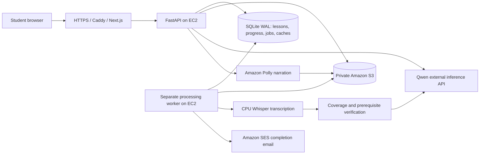

# Blindspot Edu

**Learn the step your lecture assumed. Check it, practise it, and return to the lesson with evidence.**

[Try the live app](https://blindspot-edu.online) · [Watch the complete demo](https://youtu.be/krE6TKkHGLw) · [Open the lecture library](https://blindspot-edu.online/workspace) · [Download the demo lecture](https://github.com/U7ama/blindspot-edu/raw/refs/heads/main/assets/CS501_Lecture09_Falcon_A_and_EAGLE.mp4)

Built by **Usama Aslam** for **AWS Zero to Shipped** · **#social-good · #community**

<!-- Add the published Builder Center project URL here when available. Do not link local video paths or private evidence files. -->

## The problem that started it

My brother studies Software Engineering. He often asks me about concepts he did not fully understand in class: an explanation was brief, he missed a previous class, or the lecturer assumed students already knew the background. Other students described the same difficulty.

A recording preserves what happened in class, but replaying a long lecture does not always explain the missing prerequisite. I built Blindspot Edu to help a learner find that missing step, learn it, and continue with the original lesson.

## What Blindspot does

```text
Recorded lecture
    ↓
Identify what the lecturer actually explained
    ↓
Check possible assumptions against the whole recording
    ↓
Organize a learning path with relevant prerequisite checks
    ↓
Diagnose → explain → worked example → different reassessment
    ↓
Resume the lesson, keeping its original evidence connected
```

The central feature is the **prerequisite repair journey**. A possible omission in a lecture does not automatically mean the student needs help: the diagnostic establishes whether to teach that background or let them continue.

| Feature | What a learner can do |
|---|---|
| Audio and video ingestion | Upload a file, import a supported direct media/YouTube link, or record audio/video in the browser with a preview before upload. |
| Processing progress | Follow preparation, transcription, concept extraction, prerequisite checking, planning, and verification as the worker reports progress. |
| Completion alerts | Request an email, browser notification, spoken alert, or receive an in-app completion notice. |
| Guided lesson and roadmap | Move between phases and resume the saved position after refreshing. |
| Adaptive prerequisite checks | Answer a diagnostic, read a focused explanation and worked example, then try a different application question. |
| Original recording and transcript | Play the source and inspect the timestamped segments behind a lesson explanation. |
| Evidence notebook and concept map | Review supporting excerpts, concept relationships, and possible knowledge gaps. |
| Ask in your own words | Type a question about the current lesson and receive supplementary teaching in its context. |
| Narration and appearance | Listen with browser speech or optional Amazon Polly narration; choose light, dark, or system theme. |

## Try the complete flow

**The public sample needs no registration or invitation code.**

1. Open [the lecture library](https://blindspot-edu.online/workspace) and choose the public **Lecture 19 — Advanced Computer Architecture** sample.
2. Open phase two and the **“Behavioral vs structural RTL descriptions”** prerequisite check.
3. Select **Inspect lecture evidence** to inspect its source context and timestamp.
4. Choose **Check my knowledge**, then deliberately answer incorrectly to see the teaching path.
5. Open the explanation and worked example. Try the different follow-up question.
6. After a correct answer, return to the lesson with **“Passed this check.”** Refresh to see that progress is retained.
7. Explore the question input, recording player, transcript, evidence notebook, concept map, and **Listen** controls.

### Optional upload demonstration

Download [CS501 Lecture 09 — Falcon-A and EAGLE](https://github.com/U7ama/blindspot-edu/raw/refs/heads/main/assets/CS501_Lecture09_Falcon_A_and_EAGLE.mp4), then use the **invitation code supplied in the Builder Center submission** to unlock uploads. The code is not stored in this public README. [Asset details and attribution](assets/README.md).

Upload the original file unchanged. A byte-identical recording can reuse an accessible, previously verified lesson; the screen labels its saved-stage preview. Upload transfer time still depends on the network. A new recording runs the normal transcription and lesson-generation pipeline. Keep the same browser to retain access to your private upload and progress.

The included lecture is **CS501, Advanced Computer Architecture, Virtual University of Pakistan**, distributed with the builder's confirmed permission for this educational demonstration. It remains third-party course material.

## From idea to shipped application

I used **Codex and Antigravity** for planning, implementation, review, and deployment. I followed the AWS Agent Toolkit setup instructions, connected both coding agents to AWS through MCP, and used the relevant AWS Skills for service-specific guidance.

The first version could transcribe and outline a lecture. Testing real recordings exposed what it still needed: reliable large-file uploads, valid prerequisite references, source-backed explanations, and an assessment flow that taught the missing step rather than simply advancing. Reviews and repeated testing helped turn those pieces into one complete learning journey.

Students then asked to **record lectures directly in class**, so I added browser audio/video capture. They also requested **completion notifications** because transcription and lesson preparation take time. Those requests became the recording and alert features in the app.

During development, one agent sometimes returned to generic CLI commands after several local tasks. I added explicit project rules for agent-managed AWS operations, then verified the resulting MCP calls. The working loop was: plan and build, review and test, deploy, try the live result, and improve it from user feedback.

## AWS Agent Toolkit and deployment evidence

The toolkit connected the **coding agents building and operating the app** to AWS. It is separate from the model that generates a student's lesson.

- **Skills:** Codex and Antigravity applied relevant AWS guidance during infrastructure and deployment work.
- **MCP execution:** Collected captures show actual `aws-mcp` tool calls, including `aws___run_script`/`call_boto3` and S3 presigned-URL operations, with returned AWS results.
- **Matching resources:** AWS console captures show CloudFormation stack **`blindspot-pilot`** in **`us-east-1`**, its EC2 host, S3 media storage, and Systems Manager command history.
- **Working result:** The narrated demonstration covers the live learning flow, the agents' Skills/MCP setup and operations, AWS resources, and classroom feedback.

[View Agent Toolkit connection and deployment evidence](https://youtu.be/krE6TKkHGLw?t=230). The video shows AWS Skills, actual MCP execution, and matching Systems Manager console records. Resource statuses are dated observations. The infrastructure definition is inspectable in [deploy/stack.yaml](deploy/stack.yaml), and the agent workflow is documented in [AGENTS.md](AGENTS.md).

## Architecture and active AI provider



| Component | Role |
|---|---|
| **Next.js + FastAPI** | Web interface and authorized API. |
| **EC2 t3.medium, us-east-1** | Runs the app, CPU transcription, and a separate processing worker. |
| **Whisper / faster-whisper** | Extracts timestamped speech from audio/video. |
| **SQLite in WAL mode** | Stores lessons, learner progress, job leases, transcript/model caches, and usage accounting. |
| **Qwen 3.7 Flash, external Model Studio API** | Active reasoning for concept extraction, prerequisite analysis, lesson planning, and supplementary Q&A. |
| **Amazon S3** | Private recordings, generated narration, and database backups. |
| **Amazon Polly** | Optional in-app narration; the demo video's voiceover uses Polly Stephen generative speech. |
| **Amazon SES** | One-time completion emails requested by the learner. |
| **CloudFormation** | Infrastructure as code. |
| **Systems Manager** | Remote deployment and operations. |
| **Cloudflare DNS + Caddy** | Domain resolution and HTTPS entry point. |

**Why Qwen rather than Bedrock?** I initially planned to use Amazon Bedrock. On September 28, AWS Support completed its review and could not approve the requested Nova Lite and Titan Text Embeddings V2 access for my account at that time, citing factors including payment history and account usage patterns. My account was newly created, but the response did not identify account age alone as the reason or promise an approval date.

The app therefore uses **Qwen for production inference**. A Bedrock Converse adapter is implemented but inactive. Migration will follow usable access and the same lesson-quality, evidence, latency, and cost checks. AWS already provides the app's hosting, storage, speech, email, and operations infrastructure.

## Feedback from real users

Three university students and one software engineer tested Blindspot. Their feedback is paraphrased with permission; all four reported that it helped their learning.

| Person | Role | What they found useful |
|---|---|---|
| **M Hammad** | Software Engineering student | Catching up on concepts after missing class or arriving late, without rewatching a long lecture. |
| **Hashim** | Software Engineering student | Recording a class lecture and using it to prepare afterward and understand the material. |
| **Farhan** | Computer Science student | Explanations generated for his actual lecture rather than a fixed set of course notes. |
| **Khawar** | Software engineer | Help with learning new skills. |

Their requests shaped the classroom-recording and notification features. The demonstration includes classroom usage and the feedback slide, shared with the participants' permission. This feedback describes their experiences; no numerical improvement in grades, retention, or study time is claimed.

## Evidence, privacy, and reliability

- **Distinct labels:** Lecture explanation, inferred prerequisite, and supplementary teaching stay distinguishable. Source evidence uses real segment IDs and timestamps; missing evidence is reported rather than replaced by a fabricated timestamp.
- **Whole-recording checks:** A concept explained elsewhere is reconciled with its supporting excerpts. Failed coverage verification remains uncertain, and an unvalidated optional checkpoint is not published as verified teaching.
- **Server-side assessments:** Questions have explicit concept, phase, and purpose associations. Answer keys are withheld until submission; repeated submissions are idempotent. Skipping a check does not count as passing it.
- **Learner isolation:** Anonymous secure-cookie sessions separate private uploads, progress, and preferences. The public sample shares content while keeping each learner's progress separate.
- **Durable processing:** Saved transcripts survive reasoning failures, so retrying does not repeat successful transcription. Exact duplicate matching uses server-computed SHA-256 hashes, with public/same-owner access restrictions.
- **Resource controls:** Streamed uploads, media validation, configured size/duration limits, a single processing worker, generation allowances, and cached narration control work and spending. Local cost estimates and AWS billing alerts are not hard spending caps.

Audio/video processing follows the recording's **spoken audio**; it does not yet analyze slides or diagrams visually. YouTube import depends on source availability and restrictions. Browser/spoken notifications require a supported browser and an open app tab; email can notify a learner away from the app. English narration is currently supported.

### Latest local verification — October 1, 2026

**165 backend tests** and the frontend runtime regression suite passed, along with TypeScript checking. The production build passed during the preceding local verification. Browser checks exercised the learning flow against an isolated API/database: source inspection, incorrect diagnostic, worked example, refresh restoration, different reassessment, return to the lesson, invitation persistence, theme switching, and mobile layout. No page errors or missing application chunks occurred.

On October 1, **168 backend tests passed** after improving bounded structured-output correction. A real new 49:39 Lecture20 video uploaded successfully and Whisper saved 295 transcript segments. After an initial AI coverage validation failure, retry reused that transcript and completed concept extraction, all 30 prerequisite checks, planning, and evidence review in approximately 3m 46s. The resulting three-phase lesson passed browser checks for source seeking, wrong/correct quiz feedback, assessment restoration, Q&A, and final completion. SES accepted the requested completion email. This lecture's five candidate prerequisites were explained elsewhere, so no remedial checkpoints were invented; a separate learner exercised the existing public sample's diagnostic, remediation, reassessment, idempotency, and isolation through the live local API.

The updated application was deployed to AWS on October 1 through AWS MCP. All 24 active backend source hashes matched the release manifest, and the API, worker, and frontend were healthy. Production checks passed for the public lesson library, source-linked video playback, live Q&A, Polly narration, and the diagnostic → worked example → different reassessment → return-to-lesson journey, including refresh restoration. Existing recordings and learner progress were preserved, with a tested database backup and rollback retained. The full new-video processing run above was local; production verification used existing public lessons and live inference.

## Run locally

Requirements: **Python 3.12, Node.js 22+, FFmpeg and ffprobe**. For a fresh setup:

```bash
python3.12 -m venv .venv
. .venv/bin/activate
pip install -r requirements-dev.txt
cp .env.example .env
```

If `.env` already exists, merge settings instead of overwriting it. Configure your own `LLM_BASE_URL`, `LLM_API_KEY`, and enabled model. Set a private `PILOT_INVITE_CODE` to enable uploads. The example selects local storage and disables cloud speech/email; it contains no working credentials.

Start the API and processing worker in separate terminals from the repository root:

```bash
. .venv/bin/activate
python -m uvicorn backend.main:app --host 127.0.0.1 --port 8000
```

```bash
. .venv/bin/activate
python -m backend.app.adaptive.worker
```

Start the frontend in a third terminal:

```bash
cd frontend
npm ci
npm run dev
```

Open [localhost:3000](http://localhost:3000). Local startup needs no AWS credentials; generating a new lesson needs a configured reasoning provider. The worker saves completed transcription before reasoning starts. Public samples are explicitly imported, reviewed, and published rather than automatically seeded.

<details>
<summary><strong>Developer and operator details</strong></summary>

### Configuration

Use `STORAGE_BACKEND=local|s3|r2` explicitly; absent cloud credentials never silently change the selected backend. Production uses S3 with an EC2 role. The current reasoning settings are `LLM_PROVIDER=modelstudio` and `LLM_MODEL=qwen3.7-flash`; narration uses `TTS_PROVIDER=polly` on the deployment. An enabled Kimi model can also use the compatible adapter with provider-specific configuration.

Structured output is validated, retries are bounded, and each provider attempt is accounted for. Cache hits avoid new inference calls. Set the input/output rates for the actual provider and choose deployment-specific allowances; the larger development allowances in `.env.example` do not represent the remaining AWS credits.

The Next.js/Caddy request ceiling is **250 MiB**; the API may enforce a lower upload limit. The workspace displays effective size and duration limits. Restart the API/worker after changing their environment and rebuild the frontend after changing proxy configuration.

### Add a permitted sample

```bash
python -m scripts.admin import-recording /path/to/permitted.wav --title 'Course sample' --permission-note 'Actual processing permission'
python -m scripts.admin review RECORDING_ID
python -m scripts.admin publish-sample RECORDING_ID --permission-note 'Actual public-playback permission' --reviewed
```

Run review/publish after the worker finishes. Inspect the excerpts, explanations, and answers before publication. Public content does not expose a learner's private progress. Legacy database tables remain available for export with `python -m scripts.admin export-legacy legacy.json`; obsolete API/UI modules have been removed.

### Checks and production startup

```bash
python -m pytest tests/
cd frontend
npm test
npm run typecheck
npm run build
npm start
```

Production frontend startup uses the prepared standalone server. Application API routes use `/api/v1`; the backend health route is `/health`. Preserve the database, recordings, and caches when deploying, and back up before migrations.

### Source and supporting documentation

| Path | Purpose |
|---|---|
| [backend/app/adaptive](backend/app/adaptive) | Processing, evidence verification, assessment/session state, notifications, and cost controls. |
| [frontend/src/components/adaptive](frontend/src/components/adaptive) | Active recording, processing, player, and learning UI. |
| [tests](tests) / [frontend/tests](frontend/tests) | Backend and frontend regression coverage. |
| [deploy](deploy) | CloudFormation, service definitions, and host configuration. |
| [Deployment guide](deploy/README.md) | Setup, operations, provider configuration, and recovery. |
| [Architecture](docs/ARCHITECTURE.md) | Technical architecture reference. |
| [Release checklist](docs/RELEASE_PLAN.md) | Deployment and judging checks. |
| [Builder Center draft](docs/SUBMISSION_DRAFT.md) | Editable submission text and publication tasks. |
| [Agent instructions](AGENTS.md) | Project workflow and local service commands. |

</details>

**Contact:** [Usama Aslam](mailto:usamaaslam8726@gmail.com)
