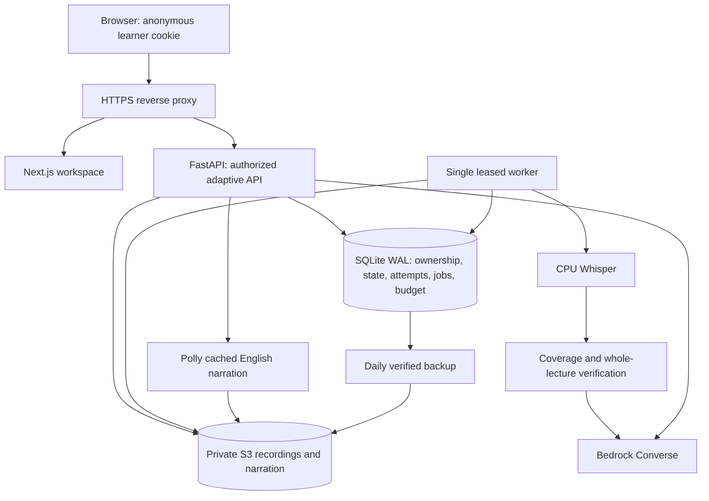

# Adaptive release architecture

A stored document contains exact transcript segment IDs. Phase evidence is checked against those excerpts. Supplementary teaching has its own label and never borrows a mention timestamp as proof of its claims. The browser never receives assessment keys before submission. Learning commands use revisions; repeated answer requests are idempotent.

The existing legacy tables remain intact. New tables use the `adaptive_` prefix. SQLite is backed up before missing tables are created. Legacy content can be exported for review using the admin CLI and reprocessed from original media; it is not automatically made public or assigned invented provenance.
